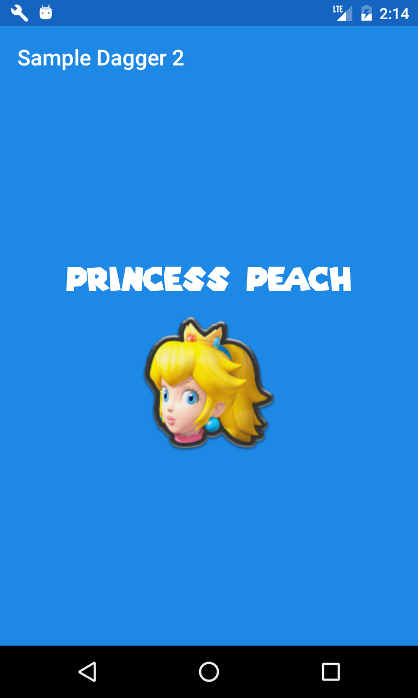

# Kata-Dagger2-MarioKart - PART 1

MarioKart Kata for Android Developers The main goal is to practice Dependency injection using Dagger 2.

This example was created to support an article explanation [Dagger 2 Kata para android developers](https://erikcaffrey.github.io/ANDROID-kata-dagger2/) (spanish).

Libraries used on the sample project
------------------------------------

* [RxJava & RxAndroid][2]
* [Dagger 2][3]

## Screenshots

Do you want to contribute?
--------------------------

Feel free to report or add any useful feature, I will be glad to improve it with your help, before submitting your code please check the [codestyle](https://github.com/square/java-code-styles).

Developed By
------------

* Erik Jhordan Rey  - <erikjhordan.rey@gmail.com>

License
-------

    Copyright 2018 Erik Jhordan Rey

    Licensed under the Apache License, Version 2.0 (the "License");
    you may not use this file except in compliance with the License.
    You may obtain a copy of the License at

       http://www.apache.org/licenses/LICENSE-2.0

    Unless required by applicable law or agreed to in writing, software
    distributed under the License is distributed on an "AS IS" BASIS,
    WITHOUT WARRANTIES OR CONDITIONS OF ANY KIND, either express or implied.
    See the License for the specific language governing permissions and
    limitations under the License.

[2]: https://github.com/ReactiveX/RxAndroid
[3]: https://github.com/google/dagger
