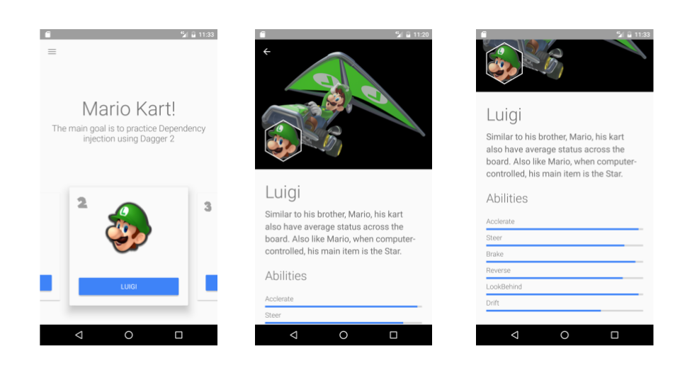

# Kata-Dagger2-MarioKart

MarioKart Kata for Android Developers The main goal is to practice Dependency injection using Dagger 2.

## Screenshots

Do you want to contribute?
--------------------------

Feel free to report or add any useful feature, I will be glad to improve it with your help, before submitting your code please check the [codestyle](https://github.com/square/java-code-styles).

Developed By
------------

* Erik González  - <erikcaffrey10@gmail.com>

